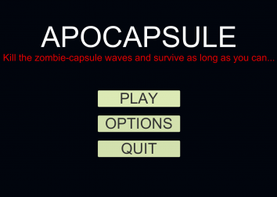
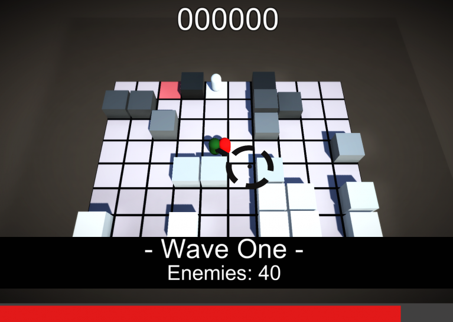

# 🧟‍♂️ Apocapsule – Isometric 2.5D Zombie Survival Game

**Apocapsule** is a fast-paced 2.5D zombie survival game where you control the last surviving capsule-person on Earth. Fight through endless waves of infected capsule-zombies, survive as long as possible, and embrace the chaos!

---

## 🎮 Game Summary

In this game, you play as the **last capsule** in a world overtaken by infected capsule-creatures. Your mission: grab your gun, survive randomized waves of enemies, and defend yourself on procedurally generated maps.

- Genre: Isometric Shooter / Survival
- Style: 2.5D (Isometric perspective)
- Objective: Survive and eliminate endless waves of enemies
- Built with **Unity** for **Windows**

---

## 🧠 Core Features

- **Random enemy spawns** across the map
- **Procedurally generated environments** for each playthrough
- Simple, fun, and chaotic gameplay loop
- Minimalist visual style with a unique "capsule" twist

---

## ▶️ How to Play (Windows Build)

1. Go to the `Build/` folder
2. Run `Apocapsule.exe`
3. Survive the zombie waves as long as you can!

> ⚠️ Antivirus software may block `.exe` files. If that happens, please allow the file manually.

---

## 🧰 Technologies Used

- Unity Engine
- C#
- Photoshop (for visual assets)

---

## 👨‍💻 Development Team

- **Guilherme Almeida** – Game Design, Development  
- **Leandro Pereira** – Game Programming, Systems

---

## 💡 Inspiration & Credits

Some mechanics and development techniques used in this game were inspired by the incredible tutorials from **Sebastian Lague** on YouTube.

> 🎥 Check out his channel: [Sebastian Lague on YouTube](https://www.youtube.com/c/SebastianLague)

We are grateful for the knowledge shared by the community and acknowledge his contributions as an influence on our work.

---

## 📸 Screenshots / Demo

### Main Menu

### Level

---

## 📥 Download Alternative

If you have trouble downloading from GitHub due to file size limits, use the following external link:

🔗 [Download via Google Drive](https://drive.google.com/file/d/1ojg5JUb7foMEzY-VcgXRazp376fYcc7k/view?usp=sharing)

---

## ⚠️ License & Source Code

This repository contains only the **game build**.  
The source code is not available for public use.  
Unauthorized redistribution or commercial use is prohibited.

---

Developed as a personal Global Game Jam 2017 project using **Unity**, for Windows PC.
